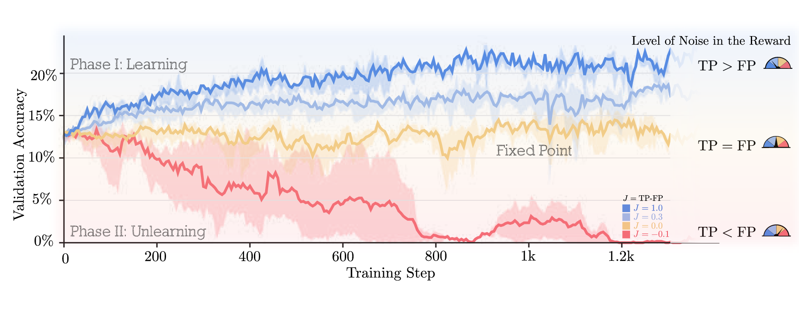

<div align="center">

# Rate or Fate?

### Reinforcement Learning with Verifiable Noisy Rewards

<br>

[](https://arxiv.org/abs/2601.04411)
[](https://cognichip.github.io/Noisy-RL/)
[](https://huggingface.co/datasets/open-r1/verifiable-coding-problems-python)
[](LICENSE)

<br>


</div>

<br>

## 🎯 TL;DR

> **Question:** Does noisy reward change the *rate* of learning or its *fate*?
>
> **Answer:** We prove a sharp phase transition—when Youden's index J = TPR − FPR > 0, noise only slows learning. When J ≤ 0, the model collapses.
>
> **Takeaway:** Your verifier doesn't need to be perfect. It just needs J > 0.

<br>

## 📰 Updates

- **2026/01** — Paper released on arXiv · [Paper](https://arxiv.org/abs/2601.04411) · [Project Page](https://cognichip.github.io/Noisy-RL/)
- **2026/01** — Training code released

<br>

## ❓ The Question

> *How sensitive is RL training to the quality of grand truth labels and rewards? Is the performance robust? Or does performance converge to a fraction of the noise-free label as simply as "you get what you pay for /garbage in, garbage out"?*

<br>

## ⚡ Key Finding

We discover a sharp phase transition in RLVR governed by **Youden's index**, as a score of the noise level of the reward:

```
J  =  TPR − FPR  =  (1 − FN) − FP
```

<table>
<tr>
<td align="center" width="100"><b>J &gt; 0</b></td>
<td>Learning proceeds · Bad modes decay to zero</td>
</tr>
<tr>
<td align="center"><b>J = 0</b></td>
<td>Neutral drift · No net learning signal</td>
</tr>
<tr>
<td align="center"><b>J &lt; 0</b></td>
<td>Anti-learning · Model collapses to wrong answers</td>
</tr>
</table>

<br>

<div align="center">

</div>

<br>

**When J > 0, noise affects the *rate* of learning, not its *fate*.**

<br>

## 🔍 Overview

RLVR is deceptively simple: sample an answer, verify it, update the model. Yet in practice, verifiers are never clean—unit tests cover only finitely many corner cases, labels carry human or synthetic noise, and LLM judges are prone to reward hacking.

We present an analytical framework for studying GRPO under general noise levels. By modeling each prompt as a multi-armed bandit over recurring reasoning modes, we derive a tractable probability-simplex flow with a **sharp noise threshold**.

### Key Contributions

- **Sharp Phase Transition** — We prove RLVR dynamics are governed by Youden's index J = TPR − FPR
- **Analytical Framework** — Tractable probability-simplex flow for understanding noisy reward learning
- **Practical Insights** — When J > 0, noise slows learning but doesn't prevent convergence
- **Experimental Validation** — Results on coding tasks confirm theoretical predictions

<br>

## 📊 Results

Performance under varying noise levels (FP = False Positive Rate, FN = False Negative Rate):

| Noise Setting | J | Converges? | Final Accuracy |
|:--------------|:-:|:----------:|:--------------:|
| Clean (FP=0, FN=0) | 1.0 | ✓ | Baseline |
| Low (FP=0.1, FN=0.1) | 0.8 | ✓ | ~Baseline |
| Medium (FP=0.2, FN=0.2) | 0.6 | ✓ | Slower convergence |
| High (FP=0.4, FN=0.4) | 0.2 | ✓ | Much slower |
| Critical (FP=0.5, FN=0.5) | 0.0 | ✗ | No learning |

<br>

## 🚀 Quick Start

```bash
git clone https://github.com/cognichip/Noisy-RL.git
cd Noisy-RL/code/training/verl
pip install -e .
```

<br>

## 🧪 Running Experiments

Edit paths in `code/training/verl/recipe/RLVeR/run_RLVeR.sh`:

```bash
MODEL_PATH="Qwen/Qwen2.5-3B"
TRAIN="path/to/train.parquet"
VAL="path/to/val.parquet"

FALSE_POSITIVE_RATE=0.1
FALSE_NEGATIVE_RATE=0.1
```

Then run:

```bash
cd code/training/verl/recipe/RLVeR
bash run_RLVeR.sh
```

See [code/training/README.md](code/training/README.md) for detailed instructions.

<br>

<details>
<summary><b>📁 Repository Structure</b></summary>

<br>

```
Noisy-RL/
├── docs/                           # Project website
├── data/
│   ├── training/                   # Training split
│   └── validation/                 # Validation split
└── code/
    └── training/
        ├── verl/recipe/RLVeR       # GRPO with noisy rewards
        └── README.md               # Training instructions
```

</details>

<details>
<summary><b>📦 Data</b></summary>

<br>

Training uses a curated subset of 10k high-quality samples from the Open-R1 project.

| Resource | Link |
|:---------|:-----|
| Dataset | [open-r1/verifiable-coding-problems-python](https://huggingface.co/datasets/open-r1/verifiable-coding-problems-python) |

</details>

<br>

## 💬 FAQ


### Q: What if J < 0?
**A:** `J < 0` is **anti-learning**: You should stop trianing immidielty. The feedback is negatively correlated with correctness. Updates tend to point in the wrong direction and performance can degrade unless you (i) flip the reward/labels, (ii) fix the grader, or (iii) add a stronger trusted signal that dominates the corrupted one.

---

### Q: Can I use this beyond GRPO?
**A:** Yes. The key requirement is a **policy-gradient–style correlation** between actions and a noisy training signal (reward/advantage). The role of `J` as an *effective signal factor* carries over to **PPO / REINFORCE / A2C-style on-policy** methods. For off-policy methods, similar effects can appear, but the mapping is less direct because replay and importance sampling also interact with noise.

---

### Q: What is the minimum J for practical training?
**A:** Any `J > 0` is learnable in principle, but compute can grow rapidly as `J -> 0+`. Two useful rules of thumb:

- **ODE / “speed” view:** learning speed is proportional to `J`  → time-to-progress scales like `~ 1/J`
- **Finite-batch / SNR view:** to keep gradient SNR roughly constant, you often need `~ 1/J^2` more samples/compute

So if `J ~ 0.5`, training is usually fine; if `J <= 0.1`, expect **very large batches/steps** or prioritize **improving the grader**.


---

### Q: How do I estimate J in practice?
**A:** On a small trusted set (or spot-checked subset), estimate `FPR` and `FNR`, then compute:

- `J = 1 - FPR - FNR`

If ground truth is expensive, approximate via agreement with a stronger grader, majority vote, or consistency checks—just be explicit about what your “truth” proxy is.

---


### Q: Does J stay constant during training?
**A:** Not necessarily. As the policy improves, the output distribution shifts and the grader’s error rates can change (domain shift, harder edge cases, reward hacking). Treat `J` as potentially time-varying (think `J(t)`), and periodically re-estimate or monitor proxies.

---


### Q: Does KL regularization “fix” low J?
**A:** KL helps **stabilize** training and prevent collapse by adding a restoring force toward a reference distribution, but it does **not** create information. If `J ~ 0`, KL can make behavior bounded/predictable while performance stays flat. When `J > 0`, KL can widen the stable regime and improve robustness.


<br>

## 🙏 Acknowledgements

- Training powered by [verl](https://github.com/volcengine/verl), an open-source RLHF library
- Data from the [Open-R1](https://huggingface.co/open-r1) project

<br>

## 📝 Citation

```bibtex
@article{rlver2025,
    title   = {Rate or Fate? RLVeR: Reinforcement Learning
               with Verifiable Noisy Rewards},
    author  = {A. Rad et al.},
    journal = {arXiv preprint},
    year    = {2026}
}
```

<br>

## 📬 Contact

Questions or feedback? Reach out at [ali@cognichip.ai](mailto:ali@cognichip.ai)

<br>

<div align="center">

Released under the [Apache 2.0 License](LICENSE)

</div>
